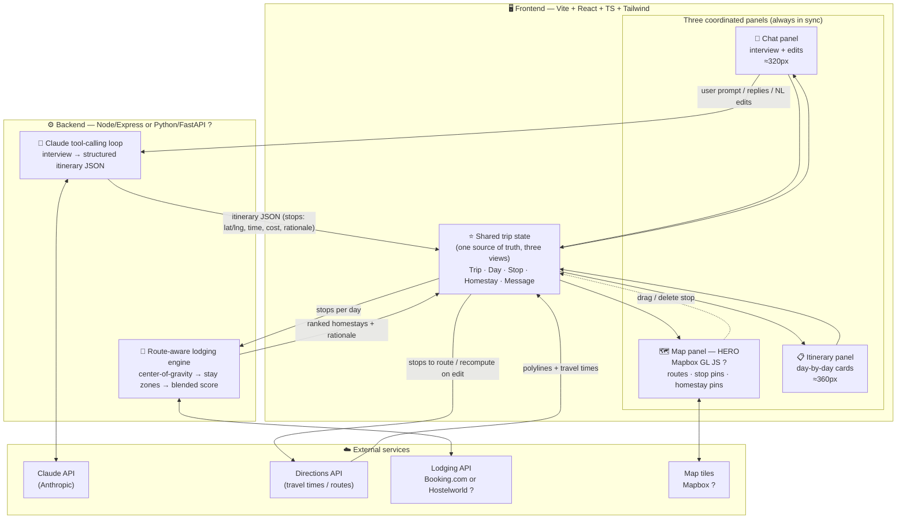
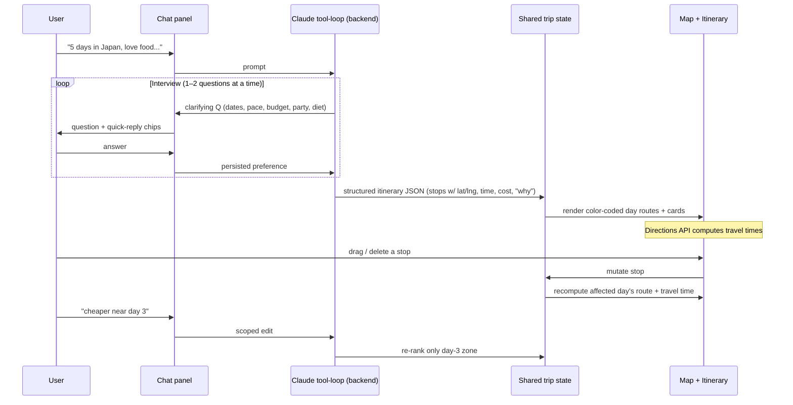
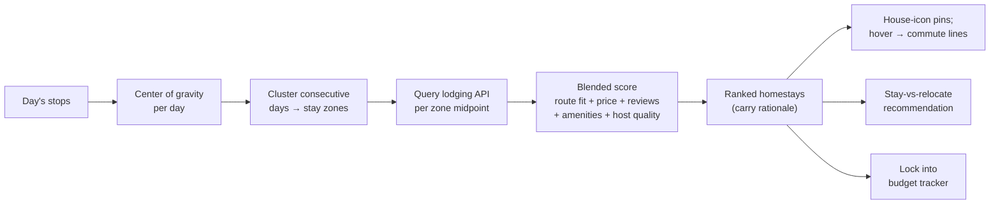

# Wanderloop — Architecture Diagram

Derived from `CLAUDE.md`, `TODO.md`, and `UI_DESIGN.md`. Reflects the **intended**
architecture (repo is pre-code). Open decisions are marked `?`.

## System overview

## AI interview → generation → edit loop

## Route-aware lodging pipeline (Phase 5 — the hard part)

## Per-day color identity

Each day owns **one hue** (`teal → amber → violet → rose → lime`), shared by its map
route polyline **and** its sidebar card — never reused within a trip. This linkage is
what makes the three panels read as coordinated.

## Open decisions (`?` above)

| Decision | Options |
|---|---|
| Map provider | **Mapbox GL** (recommended) vs Google Maps JS |
| Lodging source | Booking.com Affiliate vs Hostelworld (Airbnb has no public API) |
| Backend language | Node/Express vs Python/FastAPI |
